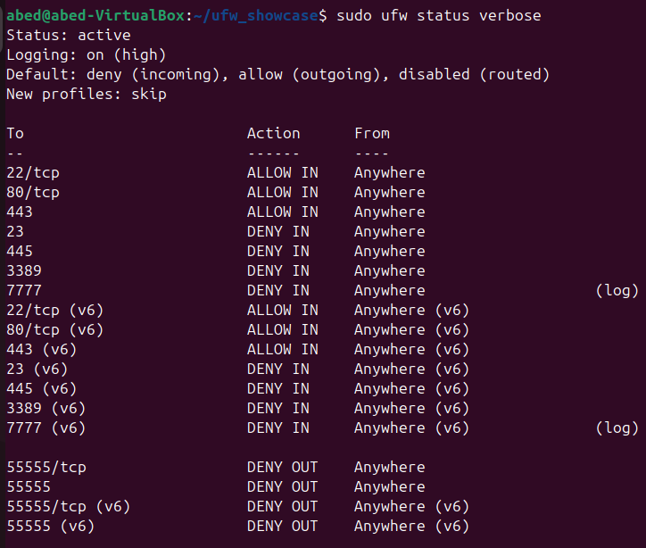
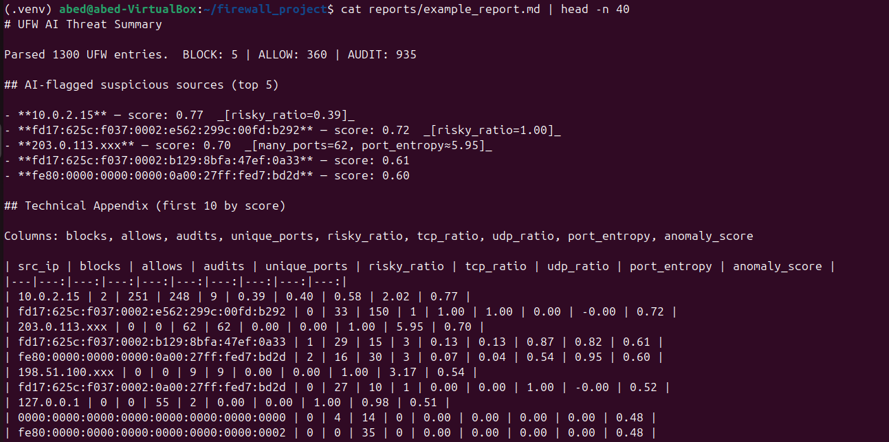

# UFW + AI Firewall Log Analyzer - Showcase Project

This project is essentially aimed to show a practical and low-cost way to add host security: 
- Configure a firewall with **UFW** (**deny by defauly**, **allow** ports 22(ssh), 80(http), 443(https) and **deny** ports 23(Telnet), 445(SMB), 3389(RDP))
- Turn on **logging** and summarize activity in **plain English** so anyone can understand
- Utilize **anomaly detection** (**Isolation Forest**) to point out **unusual IP** behavior
- Provide both **technical** and **beginner friendly** explanations


> Scope: This repo shares the firewall script, outputs (screenshots and a sanitized/blurred out report) and also selected code snippets. The full analyzer source is kept private. 

## Proof of Work

**Firewall Rules:**


**Analyzer Run:**


**AI Report Snipper:**


**Example Report:**
['reports/example_report.md'](reports/example_report.md)

## Selective Code Snippets (illustrative only)

**Parse UFW line → action/SRC/DPT/PROTO**

```python
def parse_line(line: str):
    if "UFW " not in line: return None
    action = "BLOCK" if "[UFW BLOCK]" in line else \
             "ALLOW" if "[UFW ALLOW]" in line else \
             "AUDIT" if "[UFW AUDIT]" in line else "OTHER"
    src = dpt = proto = None
    for token in line.split():
        if token.startswith("SRC="): src = token.split("=",1)[1]
        elif token.startswith("DPT="):
            try: dpt = int(token.split("=",1)[1])
            except: dpt = None
        elif token.startswith("PROTO="): proto = token.split("=",1)[1].upper()
    return {"action": action, "src": src, "dpt": dpt, "proto": proto}
```

**Isolation Forest Scoring (Higher = Suspecious)**

```python

import numpy as np
from sklearn.ensemble import IsolationForest

def score_rows(rows):
    X = np.array(rows, dtype=float)
    model = IsolationForest(n_estimators=200, contamination=0.15, random_state=42)
    model.fit(X)
    return -model.score_samples(X)

```


